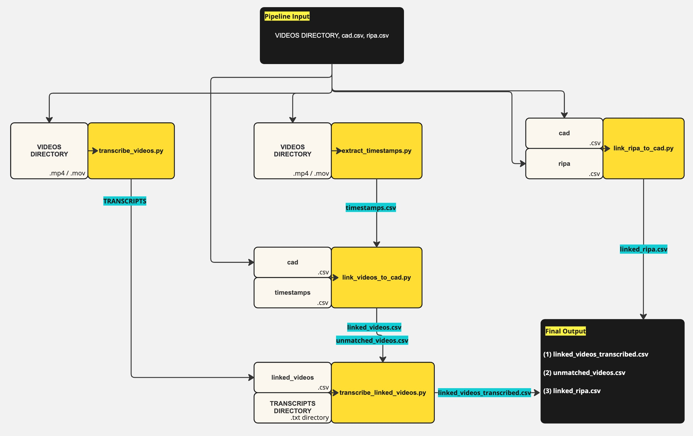

# Bodycam Video Processing Pipeline



This repository contains a pipeline to transcribe bodycam videos, extract timestamps, and assign bodycamera transcripts to computer-aided dispatch (CAD) number unique identifiers. The pipeline is designed to be run in a Unix-like environment with the provided shell script.

A demo video of the pre-processing pipeline can be found [here](https://drive.google.com/file/d/1BlchO9N9Vps_Ae2nsO2WJZLSjdo6f7GY/view?usp=sharing).

## File Descriptions

### Python Files

1. **transcribe_videos.py**
   - **Function:** Transcribes bodycam videos located in a specified directory.
   - **Usage:** `python3 transcribe_videos.py <videos_directory> <transcripts_directory>`
   - **Output:** Transcripts saved in the specified transcripts directory.

2. **extract_timestamps.py**
   - **Function:** Extracts timestamps from bodycam videos.
   - **Usage:** `python3 extract_timestamps.py <videos_directory> <output_csv_file>`
   - **Output:** Timestamps saved in the specified CSV file.

3. **link_videos_to_CAD.py**
   - **Function:** Links bodycam videos to CAD (Computer-Aided Dispatch) data using timestamps.
   - **Usage:** `python3 link_videos_to_CAD.py <cad_file> <timestamps_csv_file> <output_directory>`
   - **Output:** Linked videos saved in the specified output directory.

4. **transcribe_linked_videos.py**
   - **Function:** Combines linked videos and transcripts into a single file.
   - **Usage:** `python3 transcribe_linked_videos.py <linked_videos_csv_file> <transcripts_directory> <output_csv_file>`
   - **Output:** Combined linked videos and transcripts saved in the specified CSV file.

### Shell Script

**pipeline.sh**
- **Function:** Orchestrates the entire pipeline, prompting the user for necessary directories and files.
- **Usage:** `./pipeline.sh`
- **Steps:**
  1. Transcribes videos.
  2. Extracts timestamps from videos.
  3. Links videos to CAD using timestamps.
  4. Combines linked videos with transcripts.

## Directory Structure

The pipeline requires specific directories for input and output files. Below is the required directory structure:

```
.
├── data
│   ├── timestamps.csv               # Output file for timestamps
│   ├── linked_videos.csv            # Output file for linked videos
│   ├── unmatched_videos.csv         # Output file for videos without a link 
│   └── linked_videos_transcribed.csv # Output file for linked videos and transcripts
├── transcribe_videos.py
├── extract_timestamps.py
├── link_videos_to_CAD.py
├── transcribe_linked_videos.py
└── pipeline.sh
```

## Running the Pipeline

1. Make sure you have Python 3 and the required dependencies installed.
2. Place your bodycam videos in a directory (e.g., `videos/`).
3. Create a directory to save the transcripts to (e.g., `transcripts/`).
4. Place your CAD file in the desired location.

### Running the Shell Script

1. Open a terminal and navigate to the directory containing `pipeline.sh`.
2. Make the script executable by running `chmod +x pipeline.sh`
3. Run the script using the following Terminal command: `./pipeline.sh`
4. Follow the prompts to provide the necessary directories and files.

## Dependencies

All required dependencies are listed in the `requirements.txt` file.

## Using requirements.txt

To install the required dependencies, run the following command in your terminal:

```bash
pip install -r requirements.txt
```
# cad_bodycam_preprocessing_pipeline
